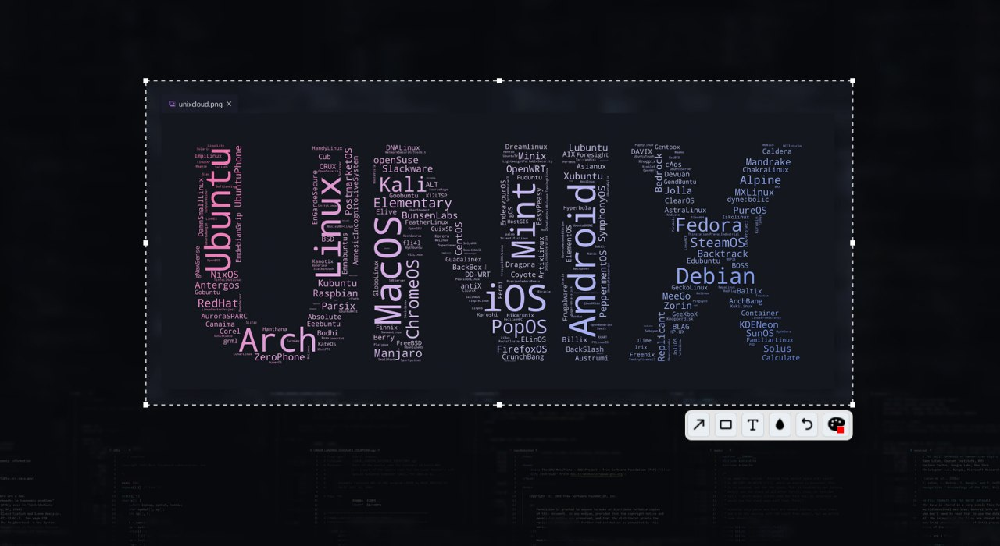

# Hyprshot


> A fast, annotation-enabled screenshot tool for **Hyprland** (Wayland), built with **Rust** and **GTK 4**.
> Capture, annotate, and copy — all in seconds.



- **Instant launcher** via `PrintScreen`
- **Pure Memory Flow** - No temporary files, everything is piped directly to the clipboard.
- **Smart Clipboard** - Integrated daemon provides both **PNG** and **BMP** targets for seamless pasting into Windows-native app (VMs, RDP).
- **Rich Annotations** - Built-in arrows, rectangles, text, and blur tool to hide sensitive data.
- **Two modes**:
    - **Quick capture**: select -> release -> done
    - **Editor mode**: `Ctrl` + select -> annotate -> `Ctrl+S` to copy

Perfect for quick sharing, bug reporting, or visual notes — without leaving your keyboard.

---

## Usage

### Quick Capture
1. Press `PrintScreen`
2. Drag to select an area
3. Release mouse -> image is copied to clipboard

### Editor Mode
1. Press `PrintScreen`
2. Drag to select an area
3. **Press `Ctrl`** -> editor panel appears
4. Draw shapes, blur sensitive data, adjust selection
5. Press `Ctrl+S` -> annotated image is copied to clipboard

### Shortcuts
- `Ctrl+Z`: Undo last action
- `Esc`: Exit without saving

> No UI windows, no dialogs — just pure speed.

---

## Installation

### From Source

Make sure you have:
- Rust (1.88+)
- `gtk4`, `glib2`, `cairo` development headers

```sh
git clone https://github.com/misery8/hyprshot.git
cd hyprshot
cargo build --release
sudo install -Dm755 target/release/hyprshot /usr/bin/hyprshot
sudo install -Dm755 target/release/clipboard /usr/lib/hyprshot/clipboard
```

## Dependencies

- Runtime:
    - `gtk4`, `glib2`, `cairo`
    - a Wayland compositor exposing `ext-image-copy-capture-v1` + `ext-image-capture-source-v1`, or `wlr-screencopy-unstable-v1` v3 as a compatibility fallback

Hyprshot captures directly through Wayland and does not invoke an external screenshot utility.

### Hyprland screencopy permission

Direct screencopy is subject to Hyprland's screencopy permission policy when permission enforcement is enabled. The installed binary is `/usr/bin/hyprshot`; configure an `allow`, `ask`, or `deny` rule for that binary according to your Hyprland version and policy. Hyprshot never edits this configuration automatically.

On current Hyprland releases using Lua configuration, an explicit allow rule is:

```lua
hl.permission({ binary = "/usr/bin/hyprshot", type = "screencopy", mode = "allow" })
```

If screencopy is denied, Hyprland may return a rendered permission-denied frame while the capture protocol itself completes normally; Hyprshot intentionally does not use pixel heuristics to hide or reinterpret that compositor response.

___

## Configuration (Hyprland)

Add to your `~/.config/hypr/hyprland.conf`:

```ini
bindl = ,Print, exec, hyprshot screen
```

## License
GPL-3.0-or-later - free and open for all.

> Made with ❤️ for the Hyprland community.